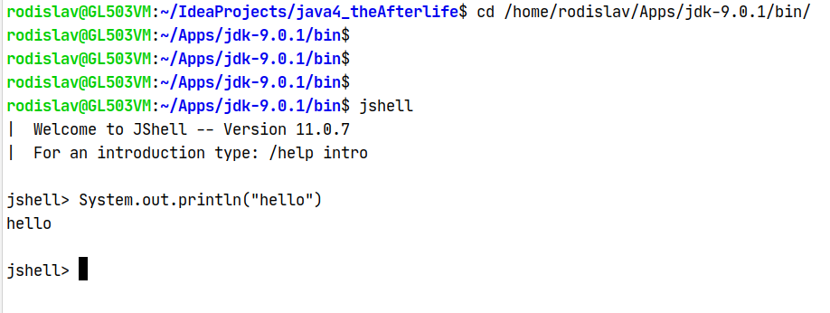
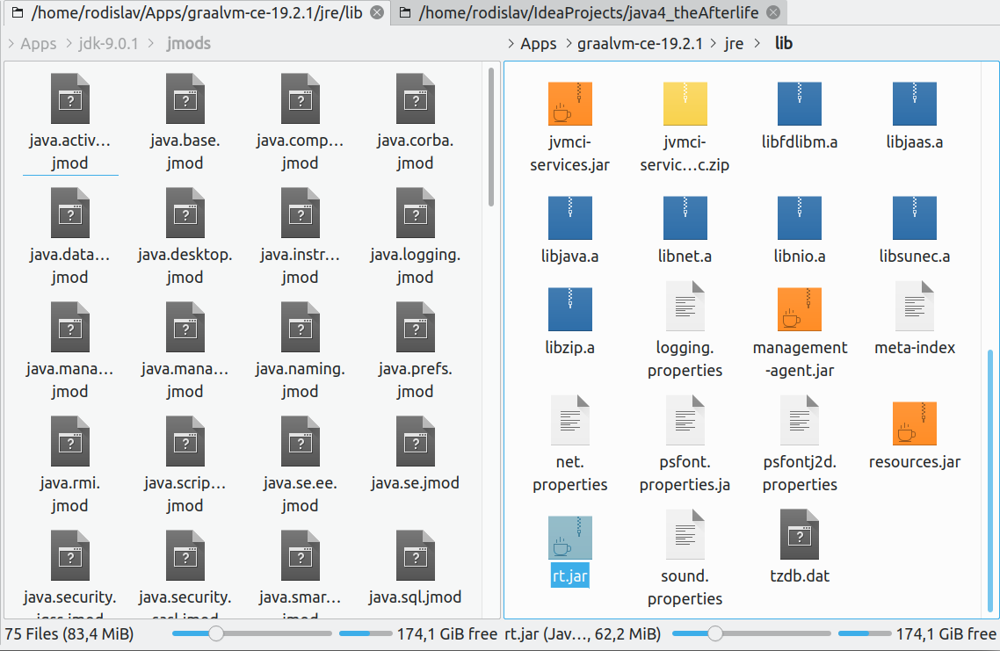

### Note

For previous versions of jdk you can download the binaries from:

https://jdk.java.net/archive/

This module requires JDK 9.

In case of `Error:java: release version 10 not supported`
> `10` is just an example, you could get any other number than 9, like 11, 8, etc.

Go to `File | Settings | Build, Execution, Deployment | Compiler | Java Compiler`
and pick the version 9 for this module.

### Java examples

The java examples are locate under `src/main/java/tothefuture`

### JShell

In order to run the JShell feature go to `${JAVA_9_HOME}/bin/` and run `jshell` binary from terminal

We can now run java code and get it interpreted on the go, in the meantime we should keep in mind that imports are not done for us, we should import things by hand.
> Which makes this shell pretty useless

### Modularity

Today we have lots of `jar` or `jmod` files instead of single `rt.jar`
> [jmod docs](https://docs.oracle.com/javase/9/tools/jmod.htm#JSWOR-GUID-0A0BDFF6-BE34-461B-86EF-AAC9A555E2AE)

> **Note** 
>
> Please consider that you might need to configure your module and set the appropriate JDK version and language level in your IDE
>
> Maven settings should work by default, but you never know.